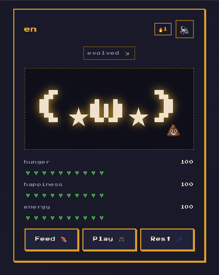

# Tiny Tamagotchi — a Lumi

> a calm companion you keep open in a background tab

**[▶ Live Demo → my-tamagotchi.vercel.app](https://my-tamagotchi.vercel.app)**



A tiny virtual pet built for the **DeepLearning.AI 7-Day Tamagotchi Challenge**.
One Lumi per user. Three stats. Three actions. No accounts, no notifications, no ads.
It hatches from a name and lives in a browser tab for as long as you let it.

The submission is **spec-driven**: every behavior in the running app traces back to a
numbered requirement in `specs/`, and every requirement traces to at least one test.

---

## What makes this one different

- **Calm by design.** 30-second tick cadence. Muted by default. No exclamation marks in body copy.
- **Audio is opt-in.** The first visit is silent. Mute persists in `localStorage`. Nothing startles you.
- **Sadness is not the reward.** No permanent death. No daily-reset anxiety. No streak pressure.
- **A hidden "Resilient" Easter egg.** If your Lumi survives a Sick phase and then evolves, it gets a special badge. No tooltip tells you.

---

## Quickstart

```bash
npm install
npm run dev       # Vite dev server → http://localhost:5173
npm test          # Vitest unit suite (77 tests, 0 failures)
npm run build     # production bundle → dist/
```

First load shows the naming screen — your Lumi hatches from whatever name you give it.

---

## Repository Map

| Path | What lives here |
|---|---|
| `specs/` | **The primary judged deliverable.** 15 spec files: `mission.md`, `roadmap.md`, `tech-stack.md` (constitution) + four feature folders each containing `feature-plan.md`, `requirements.md`, `validation.md`. |
| `src/petLogic.js` | All pure game logic — decay, clamping, catch-up, state machine, personality helpers. Zero React dependencies. Every export traces to a numbered requirement. |
| `src/App.jsx` | All React components in one file: `NamingScreen`, `StatBar`, `MuteToggle`, `PetScreen`, `App`. Owns state, tick loop, and persistence. |
| `src/audio.js` | Guarded audio preload. Missing sound files silently no-op — the app never crashes on missing audio. |
| `src/styles.css` | CSS design tokens + all keyframe animations per `specs/tech-stack.md`. |
| `tests/` | Four Vitest test files, one per feature, matching the Level 1 automated tests in each `validation.md`. |

---

## Spec-Driven Development — the rules of this repo

1. Every runtime behavior has a numbered requirement ID (`R1`, `R2`, …) in a `requirements.md` file.
2. Every requirement has at least one test in the matching `validation.md` file.
3. Code changes that alter behavior require a spec change **first**.
4. Specs are in prose + tables so humans read them; tests enforce them so machines do.

If the code says one thing and the spec says another, **the spec wins**.

---

## Rubric Map

| DeepLearning.AI criterion | Where to look |
|---|---|
| Completeness | `specs/mission.md` — mission, audience, constraints table, 8 user flows, 13 success criteria; edge-case tables in every feature |
| Clarity & specificity | Exact thresholds everywhere: `< 20` sick, `>= 50` recovery, `> 80` for 18 ticks evolution, 30% refusal probability, 300s poop delay — all in `specs/tech-stack.md` and per-feature `requirements.md` |
| Internal consistency | All values (decay rates, stat thresholds, localStorage keys, CSS classes, audio clips) defined once in `specs/tech-stack.md` and referenced by feature specs |
| Testability — 75%+ traceability | Every `validation.md` ends with a Traceability table mapping each test to a named requirement; coverage ~90–100% per feature |
| Testability — two levels | Level 1: Vitest automated tests. Level 2: manual smoke-test table. Both present in all four `validation.md` files. |
| Testability — suite implemented | `npm test` runs 77 passing Vitest tests against `src/petLogic.js` — runnable code, not pseudocode |

---

## License

MIT.
